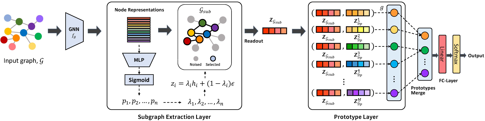

# Interpretable Prototype-based Graph Information Bottleneck
The official source code for Interpretable Prototype-based Graph Information Bottleneck at NeurIPS 2023. 
 
Overview of Interpretable Prototype-based Graph Information Bottleneck.


The success of Graph Neural Networks (GNNs) has led to a need for understanding their decision-making process and providing explanations for their predictions, which has given rise to explainable AI (XAI) that offers transparent explanations for black-box models. Recently, the use of prototypes has successfully improved the explainability of models by learning prototypes to imply training graphs that affect the prediction. However, these approaches tend to provide prototypes with excessive information from the entire graph, leading to the exclusion of key substructures or the inclusion of irrelevant substructures, which can limit both the interpretability and the performance of the model in downstream tasks. In this work, we propose a novel framework of explainable GNNs, called interpretable Prototype-based Graph Information Bottleneck (PGIB) that incorporates prototype learning within the information bottleneck framework to provide prototypes with the key subgraph from the input graph that is important for the model prediction. This is the first work that incorporates prototype learning into the process of identifying the key subgraphs that have a critical impact on the prediction performance. Extensive experiments, including qualitative analysis, demonstrate that PGIB outperforms state-of-the-art methods in terms of both prediction performance and explainability.


## Requirements
```
pytorch                   1.11.0             
torch-geometric           2.0.4
torch-scatter             2.0.9
torch-sparse              0.6.13
```
## Dataset
* Download the datasets for graph classification at this link https://chrsmrrs.github.io/datasets/
* Download the datasets for graph interpretation at this link https://github.com/Samyu0304/graph-information-bottleneck-for-Subgraph-Recognition/tree/main/graph-interpretation/input
* This folder contains the following comma separated text files (replace DS by the name of the dataset):
  - n = total number of nodes
  - m = total number of edges
  - N = number of graphs
  - DS_A.txt (m lines) : sparse (block diagonal) adjacency matrix for all graphs, each line corresponds to (row, col) resp. (node_id, node_id)
  - DS_graph_indicator.txt (n lines) : column vector of graph identifiers for all nodes of all graphs, the value in the i-th line is the graph_id of the node with node_id i
  - DS_graph_labels.txt (N lines) : class labels for all graphs in the dataset, the value in the i-th line is the class label of the graph with graph_id i
  - DS_node_labels.txt (n lines) : column vector of node labels, the value in the i-th line corresponds to the node with node_id i
* There are OPTIONAL files if the respective information is available:
  - DS_edge_labels.txt (m lines; same size as DS_A_sparse.txt) : labels for the edges in DD_A_sparse.txt 
  - DS_edge_attributes.txt (m lines; same size as DS_A.txt) : attributes for the edges in DS_A.txt 
  - DS_node_attributes.txt (n lines) : matrix of node attributes, the comma seperated values in the i-th line is the attribute vector of the node with node_id i
  - DS_graph_attributes.txt (N lines) : regression values for all graphs in the dataset, the value in the i-th line is the attribute of the graph with graph_id i


## Run

```
python -m models.train_gnns
```
